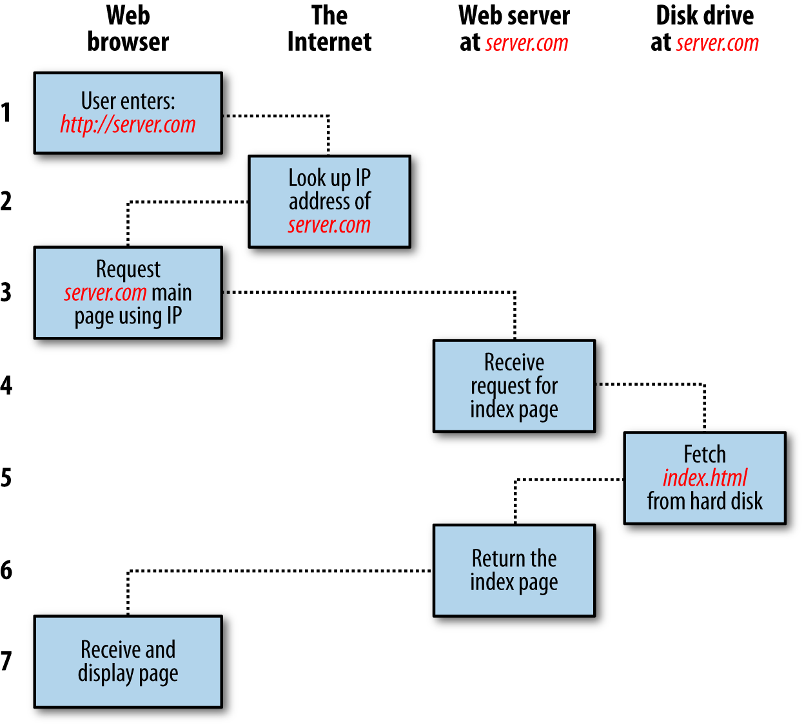
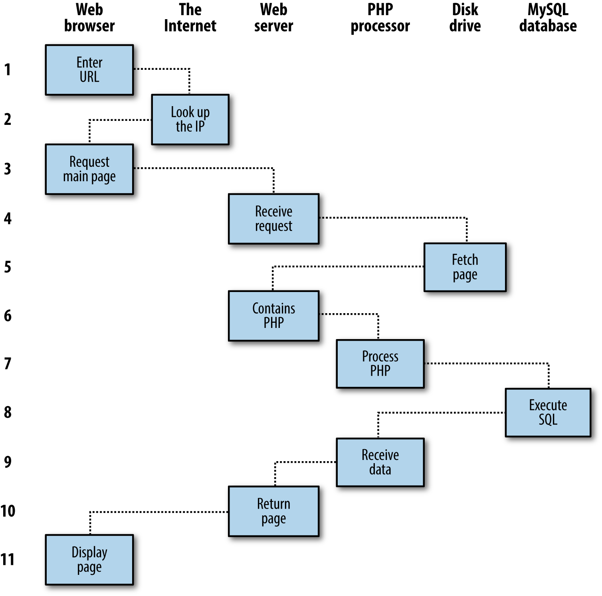
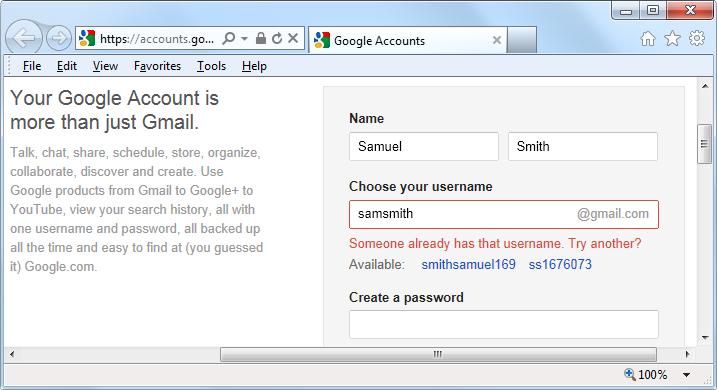

<section>
    <h2>Introduction to Dynamic Web Content</h2>
    The World Wide Web is a constantly evolving network that has already traveled far beyond its conception in the early 1990s, when it was created to solve a specific problem. State-of-the-art experiments at CERN (the European Laboratory for Particle Physics now best known as the operator of the Large Hadron Collider) were producing incredible amounts of data so much that the data was proving unwieldy to distribute to the participating scientists who were spread out across the world. 
    At this time, the Internet was already in place, with several hundred thousand com puters connected to it, so Tim Berners-Lee (a CERN fellow) devised a method of nav igating between them using a hyperlinking framework, which came to be known as Hypertext Transfer Protocol, or HTTP. He also created a markup language called Hypertext Markup Language, or HTML. To bring these together, he wrote the first web browser and web server, tools that we now take for granted. 
    But back then, the concept was revolutionary. The most connectivity so far experienced  by at home modem users was dialing up and connecting to a bulletin board that was hosted by a single computer, where you could communicate and swap data only with other users of that service. Consequently, you needed to be a member of many bulletin board systems in order to effectively communicate electronically with your colleagues and friends. 
    But Berners-Lee changed all that in one fell swoop, and by the mid 1990s, there were three major graphical web browsers competing for the attention of 5 million users. It soon became obvious, though, that something was missing. Yes, pages of text and graphics with hyperlinks to take you to other pages was a brilliant concept, but the results didn&rsquo;t reflect the instantaneous potential of computers and the Internet to meet the particular needs of each user with dynamically changing content. Using the Web was a very dry and plain experience, even if we did now have scrolling text and animated GIFs! 
    Shopping carts, search engines, and social networks have clearly altered how we use the Web. In this chapter, we&rsquo;ll take a brief look at the various components that make up the Web, and the software that helps make it a rich and dynamic experience. 
    It is necessary to start using some acronyms more or less right away. I have tried to clearly explain them before proceeding. But don&rsquo;t worry too much about what they stand for or what these names mean, because the details will become clear as you read on.
    
    <h4>HTTP and HTML: Berners-Lee&rsquo;s Basics</h4>
    HTTP is a communication standard governing the requests and responses that take place between the browser running on the end user&rsquo;s computer and the web server. The server&rsquo;s job is to accept a request from the client and attempt to reply to it in a meaningful way, usually by serving up a requested web page that&rsquo;s why the term server is used. The natural counterpart to a server is a client , so that term is applied both to the web browser and the computer on which it&rsquo;s running. 
    Between the client and the server there can be several other devices, such as routers, proxies, gateways, and so on. They serve different roles in ensuring that the requests and responses are correctly transferred between the client and server. Typically, they use the Internet to send this information. 
    A web server can usually handle multiple simultaneous connections and when not communicating with a client spends its time listening for an incoming connection. When one arrives, the server sends back a response to confirm its receipt.
    
    <h3>The Request/Response Procedure</h3>
    At its most basic level, the request/response process consists of a web browser asking the web server to send it a web page and the server sending back the page. The browser then takes care of displaying the page (see Figure 1-1 ). 
    

    Figure 1-1. The basic client/server request/response sequence 
    Each step in the request and response sequence is as follows: 
    1. You enter http://server.com into your browser&rsquo;s address bar. 
    2. Your browser looks up the IP address for server.com. 
    3. Your browser issues a request for the home page at server.com. 
    4. The request crosses the Internet and arrives at the server.com web server. 
    5. The web server, having received the request, looks for the web page on its disk. 
    6. The web page is retrieved by the server and returned to the browser. 
    7. Your browser displays the web page. 
    For an average web page, this process takes place once for each object within the page: a graphic, an embedded video or Flash file, and even a CSS template. 
    In step 2, notice that the browser looked up the IP address of &nbsp;server.com. Every machine attached to the Internet has an IP address your computer included. But we generally access web servers by name, such as google.com. As you probably know, the browser consults an additional Internet service called the Domain Name Service (DNS) to find its associated IP address and then uses it to communicate with the computer. 
    For dynamic web pages, the procedure is a little more involved, because it may bring both PHP and MySQL into the mix (see Figure 1-2 ). 
    

    Figure 1-2. A dynamic client/server request/response sequence 
    1. You enter http://server.com into your browser&rsquo;s address bar. 
    2. Your browser looks up the IP address for server.com. 
    3. Your browser issues a request to that address for the web server&rsquo;s home page. 
    4. The request crosses the Internet and arrives at the server.com web server. 
    5. The web server, having received the request, fetches the home page from its hard disk. 
    6. With the home page now in memory, the web server notices that it is a file incor porating PHP scripting and passes the page to the PHP interpreter. 
    7. The PHP interpreter executes the PHP code. 
    8. Some of the PHP contains MySQL statements, which the PHP interpreter now passes to the MySQL database engine. 
    9. The MySQL database returns the results of the statements to the PHP interpreter. 
    10. The PHP interpreter returns the results of the executed PHP code, along with the results from the MySQL database, to the web server. 
    11. The web server returns the page to the requesting client, which displays it. Although it&rsquo;s helpful to be aware of this process so that you know how the three ele ments work together, in practice you don&rsquo;t really need to concern yourself with these details, because they all happen automatically. 
    HTML pages returned to the browser in each example may well contain JavaScript, which will be interpreted locally by the client, and which could initiate another request the same way embedded objects such as images would.
    
    <h3>The Benefits of PHP, MySQL, JavaScript, CSS, and HTML5</h3>
    At the start of this chapter, I introduced the world of Web 1.0, but it wasn&rsquo;t long before the rush was on to create Web 1.1, with the development of such browser enhancements as Java, JavaScript, JScript (Microsoft&rsquo;s slight variant of JavaScript), and ActiveX. On the server side, progress was being made on the Common Gateway Interface (CGI) using scripting languages such as Perl (an alternative to the PHP lan guage) and server side scripting  inserting the contents of one file (or the output of a system call) into another one dynamically. 
    Once the dust had settled, three main technologies stood heads and shoulders above the others. Although Perl was still a popular scripting language with a strong follow ing, PHP&rsquo;s simplicity and built-in links to the MySQL database program had earned it more than double the number of users. And JavaScript, which had become an essential part of the equation for dynamically manipulating Cascading Style Sheets (CSS) and HTML, now took on the even more muscular task of handling the client side of the Ajax process. Under Ajax, web pages perform data handling and send requests to web servers in the background without the web user being aware that this is going on. 
    No doubt the symbiotic nature of PHP and MySQL helped propel them both forward, but what attracted developers to them in the first place? The simple answer has to be the ease with which you can use them to quickly create dynamic elements on websites. MySQL is a fast and powerful, yet easy to use, database system that offers just about anything a website would need in order to find and serve up data to brows ers. When PHP allies with MySQL to store and retrieve this data, you have the funda mental parts required for the development of social networking sites and the beginnings of Web 2.0. 
    And when you bring JavaScript and CSS into the mix too, you have a recipe for build- ing highly dynamic and interactive websites.
    
    <h4>Using PHP</h4>
    With PHP, it&rsquo;s a simple matter to embed dynamic activity in web pages. When you give pages the.php extension, they have instant access to the scripting language. From a developer&rsquo;s point of view, all you have to do is write code such as the following:
<pre><code class="php">
&lt;?php
    echo " Today is ". date("l"). ". ";
?&gt;
Here's the latest news.
</code>
</pre>
    The opening &lt;?php tells the web server to allow the PHP program to interpret all the following code up to the ?&gt; tag. Outside of this construct, everything is sent to the client as direct HTML. So the text Here's the latest news. is simply output to the browser; within the PHP tags, the built-in date function displays the current day of the week according to the server&rsquo;s system time. 
    The final output of the two parts looks like this: 
    <b class="t30">Today is Wednesday. Here's the latest news.</b> 
    PHP is a flexible language, and some people prefer to place the PHP construct directly next to PHP code, like this:
    <pre><code class="php">Today is &lt;?php echo date("l"); ?&gt;. Here's the latest news.</code></pre>
    There are also other ways of formatting and outputting information, which I&rsquo;ll explain in the chapters on PHP. The point is that with PHP, web developers have a scripting language that, although not as fast as compiling your code in C or a similar language, is incredibly speedy and also integrates seamlessly with HTML markup. 
    If you intend to enter the PHP examples in this book to work along with me, you must remember to add &lt;?php in front and ?&gt; after them to ensure that the PHP interpreter processes them. To facilitate this, you may wish to prepare a file called &nbsp;example.php &nbsp;with those tags in place. 
    Using PHP, you have unlimited control over your web server. Whether you need to modify HTML on the fly, process a credit card, add user details to a database, or fetch information from a third party website, you can do it all from within the same PHP files in which the HTML itself resides. 
    
    <h4>Using MySQL</h4>
    Of course, there&rsquo;s not a lot of point to being able to change HTML output dynami cally unless you also have a means to track the changes that users make as they use your website. In the early days of the Web, many sites used &ldquo;flat&rdquo; text files to store data such as usernames and passwords. But this approach could cause problems if the file wasn&rsquo;t correctly locked against corruption from multiple simultaneous accesses. Also, a flat file can get only so big before it becomes unwieldy to manage not to mention the difficulty of trying to merge files and perform complex searches in any kind of reasonable time. 
    That&rsquo;s where relational databases with structured querying become essential. And MySQL, being free to use and installed on vast numbers of Internet web servers, rises superbly to the occasion. It is a robust and exceptionally fast database management system that uses English like commands. 
    The highest level of MySQL structure is a database, within which you can have one or more tables that contain your data. For example, let&rsquo;s suppose you are working on a table called users , within which you have created columns for surname , firstname , and email , and you now wish to add another user. One command that you might use to do this is as follows:
    <pre><code class="sql">INSERT INTO users VALUES('Smith', 'John', 'jsmith@mysite.com');</code></pre>
    Of course, as mentioned earlier, you will have issued other commands to create the database and table and to set up all the correct fields, but the INSERT command here shows how simple it can be to add new data to a database. INSERT is an example of Structured Query Language (SQL), a language designed in the early 1970s and reminiscent of one of the oldest programming languages, COBOL. It is well suited, however, to database queries, which is why it is still in use after all this time. 
    It&rsquo;s equally easy to look up data. Let&rsquo;s assume that you have an email address for a user and need to look up that person&rsquo;s name. To do this, you could issue a MySQL query such as the following:
    <pre><code class="sql">SELECT surname,firstname FROM users WHERE email='jsmith@mysite.com';</code></pre>
    MySQL will then return Smith, John and any other pairs of names that may be associated with that email address in the database. 
    As you&rsquo;d expect, there&rsquo;s quite a bit more that you can do with MySQL than just simple INSERT and SELECT commands. For example, you can join multiple tables according to various criteria, ask for results in a variety of orders, make partial matches when you know only part of the string that you are searching for, return only the n th result, and a lot more. 
    Using PHP, you can make all these calls directly to MySQL without having to run the MySQL program yourself or use its command line interface. This means you can save the results in arrays for processing and perform multiple lookups, each dependent on the results returned from earlier ones, to drill down to the item of data you need. 
    For even more power, as you&rsquo;ll see later, there are additional functions built right into MySQL that you can call up for common operations and extra speed.
    
    <h4>Using JavaScript</h4>
    The oldest of the three core technologies in this book, JavaScript, was created to enable scripting access to all the elements of an HTML document. In other words, it provides a means for dynamic user interaction such as checking email address validity in input forms, and displaying prompts such as &ldquo;Did you really mean that?&rdquo; (although it cannot be relied upon for security, which should always be performed on the web server). 
    Combined with CSS (see the following section), JavaScript is the power behind dynamic web pages that change in front of your eyes rather than when a new page is returned by the server. However, JavaScript can also be tricky to use, due to some major differences in the ways different browser designers have chosen to implement it. This mainly came about when some manufacturers tried to put additional functionality into their browsers at the expense of compatibility with their rivals. 
    Thankfully, the developers have mostly now come to their senses and have realized the need for full compatibility with one another, so they don&rsquo;t have to write multi  exception code. But there remain millions of legacy browsers that will be in use for a good many years to come. Luckily, there are solutions for the incompatibility problems, and later in this book we&rsquo;ll look at libraries and techniques that enable you to safely ignore these differences. 
    For now, let&rsquo;s take a look at how to use basic JavaScript, accepted by all browsers:
    <pre><code class="javascript">
&lt;script type="text/javascript"&gt;
  document.write("Today is " + Date() );
&lt;/script&gt;
        </code></pre>
    This code snippet tells the web browser to interpret everything within the script tags as JavaScript, which the browser then does by writing the text Today is to the current document, along with the date, by using the JavaScript function Date. The result will look something like this: 
    <b class="t30">Today is Sun Jan 01 2017 01:23:45</b> 
    Unless you need to specify an exact version of JavaScript, you can normally omit the type="text/javascript" and just use &lt;script&gt; to start the interpretation of the JavaScript. 
    As previously mentioned, JavaScript was originally developed to offer dynamic control over the various elements within an HTML document, and that is still its main use. But more and more, JavaScript is being used for Ajax. This is a term for the process of accessing the web server in the background. (It originally meant Asynchronous JavaScript and XML , but that phrase is already a bit outdated.) 
    Ajax is the main process behind what is now known as Web 2.0 (a term popularized by Tim O&rsquo;Reilly, the founder and CEO of this book&rsquo;s publishing company), in which web pages have started to resemble standalone programs, because they don&rsquo;t have to be reloaded in their entirety. Instead, a quick Ajax call can pull in and update a single element on a web page, such as changing your photograph on a social networking site or replacing a button that you click with the answer to a question. This subject is fully covered in Chapter 17. 
    Then, in Chapter 21 , we take a good look at the jQuery framework, which you can use to save reinventing the wheel when you need fast, cross browser code to manipulate your web pages. Of course, there are other frameworks available too, but jQuery is by far the most popular and, due to continuous maintenance, is extremely reliable, and a major tool in the utility kit of many seasoned web developers.
    
    <h4>Using CSS</h4>
    With the emergence of the CSS3 standard in recent years, CSS now offers a level of dynamic interactivity previously supported only by JavaScript. For example, not only can you style any HTML element to change its dimensions, colors, borders, spacing, and so on, but now you can also add animated transitions and transformations to your web pages, using only a few lines of CSS. 
    Using CSS can be as simple as inserting a few rules between &lt;style&gt; and &lt;/style&gt; tags in the head of a web page, like this:
<pre><code class="css">&lt;style&gt; p {text-align:justify; font-family:Helvetica;} &lt;/style&gt;</code></pre>
    These rules will change the default text alignment of the &lt;p&gt; tag so that paragraphs contained in it will be fully justified and will use the Helvetica font. 
    As you&rsquo;ll learn in Chapter 18 , there are many different ways you can lay out CSS rules, and you can also include them directly within tags or save a set of rules to an external file to be loaded in separately. This flexibility not only lets you style your HTML precisely, but it can also (for example) provide built-in hover functionality to animate objects as the mouse passes over them. You will also learn how to access all of an element&rsquo;s CSS properties from JavaScript as well as HTML.
    
    <h3>And Then There&rsquo;s HTML5</h3>
    As useful as all these additions to the web standards became, they were not enough for ever more ambitious developers. For example, there was still no simple way to manipulate graphics in a web browser without resorting to plug-ins such as Flash. And the same went for inserting audio and video into web pages. Plus, several annoying inconsistencies had crept into HTML during its evolution. 
    So, to clear all this up and take the Internet beyond Web 2.0 and into its next iteration, a new standard for HTML was created to address all these shortcomings. It was called HTML5 and it began development as long ago as 2004, when the first draft was drawn up by the Mozilla Foundation and Opera Software (developers of two popular web browsers). But it wasn&rsquo;t until the start of 2013 that the final draft was submitted to the World Wide Web Consortium (W3C), the international governing body for web standards. 
    With nine years for it to develop, you might think that would be the end of the specification, but that&rsquo;s not how things work on the Internet. Although websites come and go at great speed, the underlying software is developed slowly and carefully, and so the stable recommendation for HTML5 is expected only after this edition of the book has been published in late 2014. And then guess what? Work will move on to versions  5.1 and higher, beginning in 2015. It&rsquo;s a never-ending cycle of development. 
    However, while HTML5.1 is planned to bring some handy improvements (mainly to the canvas), basic HTML5 is the new standard web developers now need to work to, and it will remain in place for many years to come. So learning everything you can about it now will stand you in very good stead. 
    There&rsquo;s actually a great deal of new stuff in HTML (and quite a few things that have been changed or removed), but in summary, here&rsquo;s what you get: 
    <i>Markup</i>
    
Including new elements such as &lt;nav&gt; and &lt;footer&gt; , and deprecated elements like &lt;font&gt; and &lt;center&gt;.

    <i>New APIs</i>
    
Such as the &lt;canvas&gt; element for writing and drawing on a graphics canvas, &lt;audio&gt; and &lt;video&gt; elements, offline web applications, microdata, and local storage.

    <i>Applications</i>
    
Including two new rendering technologies: MathML (Math Markup Language) for
    displaying mathematical formulae and SVG (Scalable Vector Graphics) for creating graphical elements outside of the new &lt;canvas&gt; element. However, MathML and
    SVG are somewhat specialist, and are so feature-packed they would need a book of their own, so I don&rsquo;t cover them here. 
    

    All these things (and more) are covered in detail starting in Chapter 22. 
    One of the little things I like about the HTML5 specification is that XHTML syntax is no longer required for self-closing elements. In the past, you could display a line break using the &lt;br&gt; element. Then, to ensure future compatibility with XHTML (the planned replacement for HTML that never happened), this was changed to &lt;br /&gt; , in which a closing / character was added (since all elements  were expected to include a closing tag featuring this character). But now things have gone full circle, and you can use either version of these types of element. So, for the sake of brevity and fewer keystrokes, in this book I have reverted to the former style of &lt;br&gt; , &lt;hr&gt; , and so on. 
    
    <h3>The Apache Web Server</h3>
    In addition to PHP, MySQL, JavaScript, CSS, and HTML5, there&rsquo;s a sixth hero in the dynamic Web: the web server. In the case of this book, that means the Apache web server. We&rsquo;ve discussed a little of what a web server does during the HTTP server/ client exchange, but it does much more behind the scenes. 
    For example, Apache doesn&rsquo;t serve up just HTML files it handles a wide range of files from images and Flash files to MP3 audio files, RSS (Really Simple Syndication) feeds, and so on. To do this, each element a web client encounters in an HTML page is also requested from the server, which then serves it up. 
    But these objects don&rsquo;t have to be static files such as GIF images. They can all be generated  by programs such as PHP scripts. That&rsquo;s right: PHP can even create images and other files for you, either on the fly or in advance to serve up later. 
    To do this, you normally have modules either precompiled into Apache or PHP or called up at runtime. One such module is the GD (Graphics Draw) library, which PHP uses to create and handle graphics. 
    Apache also supports a huge range of modules of its own. In addition to the PHP module, the most important for your purposes as a web programmer are the modules that handle security. Other examples are the Rewrite module, which enables the web server to handle a varying range of URL types and rewrite them to its own internal requirements, and the Proxy module, which you can use to serve up often requested pages from a cache to ease the load on the server. 
    Later in the book, you&rsquo;ll see how to use some of these modules to enhance the features  provided by the three core technologies. 
    
    <h3>About Open Source</h3>
    Whether or not being open source is the reason these technologies are so popular has often been debated, but PHP, MySQL, and Apache are the three most commonly used tools in their categories. What can be said definitively, though, is that their being open source means that they have been developed in the community by teams of programmers  writing the features they themselves want and need, with the original code available for all to see and change. Bugs can be found and security breaches can be prevented before they happen. 
    There&rsquo;s another benefit: all these programs are free to use. There&rsquo;s no worrying about having to purchase additional licenses if you have to scale up your website and add more servers. And you don&rsquo;t need to check the budget before deciding whether to upgrade to the latest versions of these products.
    
    <h3>Bringing It All Together</h3>
    The real beauty of PHP, MySQL, JavaScript (sometimes aided by jQuery or other frameworks), CSS, and HTML5 is the wonderful way in which they all work together to produce dynamic web content: PHP handles all the main work on the web server, MySQL manages all the data, and the combination of CSS and JavaScript looks after web page presentation. JavaScript can also talk with your PHP code on the web server whenever it needs to update something (either on the server or on the web page). And with the powerful new features in HTML5, such as the canvas, audio and video, and geolocation, you can make your web pages highly dynamic, interactive, and multimedia packed. 
    Without using program code, let&rsquo;s summarize the contents of this chapter by looking at the process of combining some of these technologies into an everyday Ajax feature that many websites use: checking whether a desired username already exists on the site when a user is signing up for a new account. A good example of this can be seen with Gmail (see Figure 1-3 ). 
    

    Figure 1-3. Gmail uses Ajax to check the availability of usernames 
    The steps involved in this Ajax process would be similar to the following: 
    1. The server outputs the HTML to create the web form, which asks for the necessary  details, such as username, first name, last name, and email address. 
    2. At the same time, the server attaches some JavaScript to the HTML to monitor the username input box and check for two things: (a) whether some text has been typed into it, and (b) whether the input has been deselected because the user has clicked on another input box. 
    3. Once the text has been entered and the field deselected, in the background the JavaScript code passes the username that was entered back to a PHP script on the web server and awaits a response. 
    4. The web server looks up the username and replies back to the JavaScript regarding  whether that name has already been taken. 
    5. The JavaScript then places an indication next to the username input box to show whether the name is one available to the user perhaps a green checkmark or a red cross graphic, along with some text. 
    6. If the username is not available and the user still submits the form, the JavaScript interrupts the submission and reemphasizes (perhaps with a larger graphic and/or an alert box) that the user needs to choose another username. 
    7. Optionally, an improved version of this process could even look at the username requested by the user and suggest an alternative that is currently available. All of this takes place quietly in the background and makes for a comfortable and seamless user experience. Without Ajax, the entire form would have to be submitted to the server, which would then send back HTML, highlighting any mistakes. It would be a workable solution, but nowhere near as tidy or pleasurable as on the fly form-field processing. 
    Ajax can be used for a lot more than simple input verification and processing, though; we&rsquo;ll explore many additional things that you can do with it in the Ajax chapters  later in this book. 
    In this chapter, you have read a good introduction to the core technologies of PHP, MySQL, JavaScript, CSS, and HTML5 (as well as Apache), and have learned how they work together. In Chapter 2 , we&rsquo;ll look at how you can install your own web development  server on which to practice everything that you will be learning.
</section>